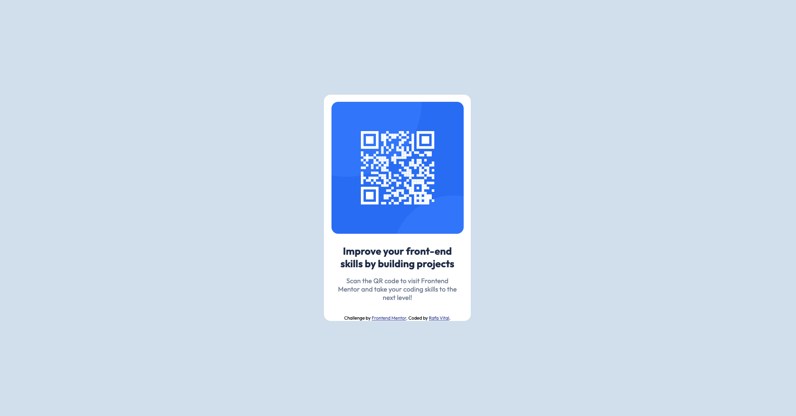

# Frontend Mentor - QR code component solution

This is a solution to the [QR code component challenge on Frontend Mentor](https://www.frontendmentor.io/challenges/qr-code-component-iux_sIO_H). Frontend Mentor challenges help you improve your coding skills by building realistic projects. 

## Table of contents

- [Overview](#overview)
  - [Screenshot](#screenshot)
  - [Links](#links)
- [My process](#my-process)
  - [Built with](#built-with)
  - [What I learned](#what-i-learned)
  - [Continued development](#continued-development)
  - [Useful resources](#useful-resources)
- [Author](#author)

## Overview

### Screenshot



### Links

- Solution URL: https://github.com/rafavital/frontend-mentor_qr-code-component
- Live Site URL: [https://rafavital.github.io](https://rafavital.github.io/frontend-mentor_qr-code-component/)

## My process

- I started by understanding the challenges pre-requisites and analysing which assets I had available.
- Then I proceeded to outline the HTML structure in order to create a cohesive hierarchy of components.
- Finally I worked on the styling, first I centered and aligned items, then colored them and made any final adjustments.

### Built with

- Semantic HTML5 markup
- CSS custom properties
- Flexbox
- CSS Grid
- Mobile-first workflow

### What I learned

In this project I was able to exercise intializing a basic HTML page, specially on importing fonts.
```html
<link href="https://fonts.googleapis.com/css2?family=Outfit:wght@400;700&display=swap" rel="stylesheet">
```

I also learned how to reset a page's layout in order to have a clean canvas when styling.

```css
* {
    margin: 0;
    padding: 0;
    box-sizing: border-box;
    font-family: 'Outfit', sans-serif;
}
```

I was also able to exercise CSS Flexbox styling

```css
display: flex; 
align-items: center;
justify-content: center ;
```

### Useful resources

- [Desafio Front-end Mentor #1 - Card de Resumo do Pedido - HTML/CSS](https://www.youtube.com/watch?v=ap_KHxw4Q_E) - This video helped me on setting up the initial project and planning how to tackle the styling.

## Author

- Website - [Rafa Vital](https://rafavital.com.br/)
- Frontend Mentor - [@rafavital](https://www.frontendmentor.io/profile/rafavital)
